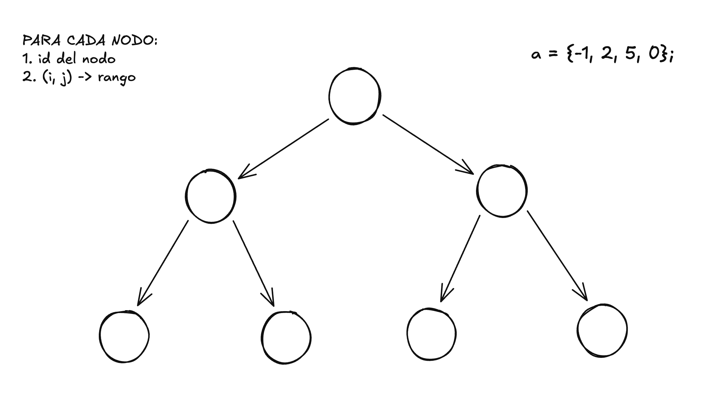
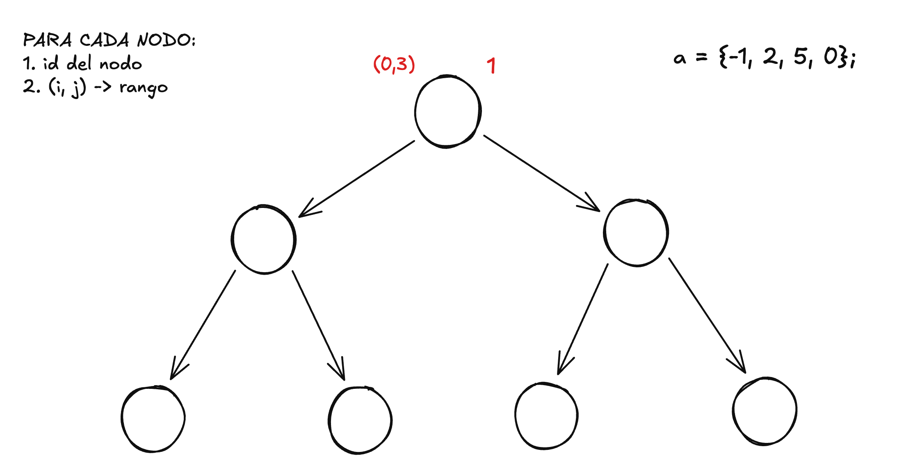
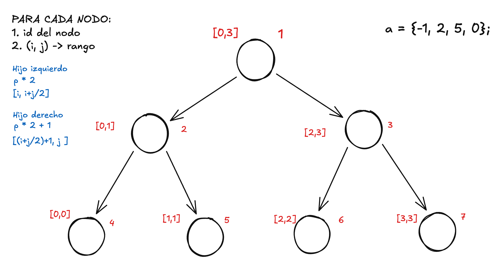

# Grafos
**Este es la sección explicada de los algoritmos relacionados a los grafos del NoteBook de NikoBross, esta explicación asume que  usted sabe como se crea un grafo y sus recorridos basicos: BFS y DFS**

## Segment Tree
El segment tree es un albol binario que se nos presenta como la solucion cuando tenemos un conjunto de elementos y se requiere hacer queries en rango y actualizaciones sobre estos.

### ¿Cuando utilizar el segmentTree? - Generalizaciones
* Cuando tenemos un conjunto S, como lo seria el de los numeros enteros
* Requerimos hacer operaciones binarias con propiedades asocitavas: suma, multiplicación, maximo o minimo
* Contamos con un elemento neutro, en la suma es el numero cero

Para mayor entendimiento de este algoritmo trabajaremos con **_el array de numero enteros y con la operación de suma_**
```
a = {-1, 2, 5, 0};
```
La explicación de este algoritmo la divideremos en 3 partes: 
* Su construcción
* Su consulta en rango
* Su actualización

### Construcción del segment tree

Ya que hablamos de un arbol binario, podemos decir que un segment tree tendria esta forma a la hora de construirlo; en este algoritmo cada nodo tiene 2 atributos indispensables para su funcionamiento: un id para identidificar cada nodo y un tupla (i,j) que nos indica el rango que aquel nodo maneja.



Ahora bien ¿Comó introducimos nuestro array de numeros en el? arrancaremos desde la raiz de nuestro arbol, dando como indice el numero 1, ya que es el nodo 1 y la tupla  (0,3) que es el rango completo de nuestro array. 



Ya con los atributos de nuestra raiz, podemos pasar a calcular su valor. Pero, para esto es necesario calcular sus hijos primero, para ello le daremos los atributos de sus hijos de la siguiente manera:
* el ID del hijo izquierdo = id del padre * 2
* el ID del hijo derecho = id del padre * 2 + 1
* El rango del hijo izquierdo = (el i del padre, i + j / 2)
* El rango del hijo izquierdo = ((i + j / 2) + 1, el J del padre)



Como los hijos directos del la raiz tampoco tienen ningun valor todavia, ellos tienen que calcular tambien el valor de sus hijos primero. La condicion de parada en esta recursión es cuando el i,j son iguales y como se puede apreciar esto solo ocurre cuando es una hoja. Como se puede apreciar, las hojas indicanel indice del valor en nuestro array con el que se tiene que llenar, una vez esto suceda se puede empezar a retornar la recursión y por ende calcular todos los nodos y ahi pa' arriba **sabiendo que en este caso un nodo padre es igual a la suma de los valores de sus hijos**.

